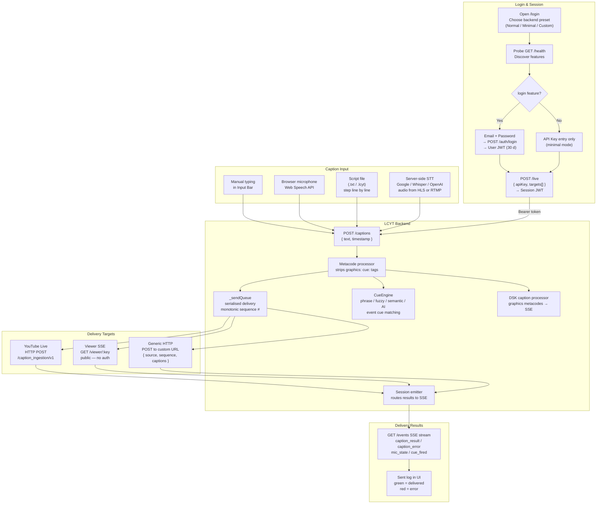
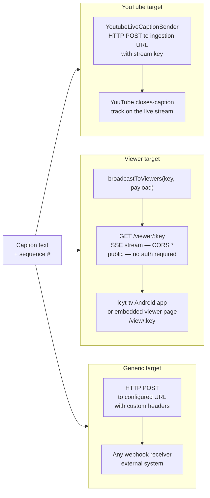
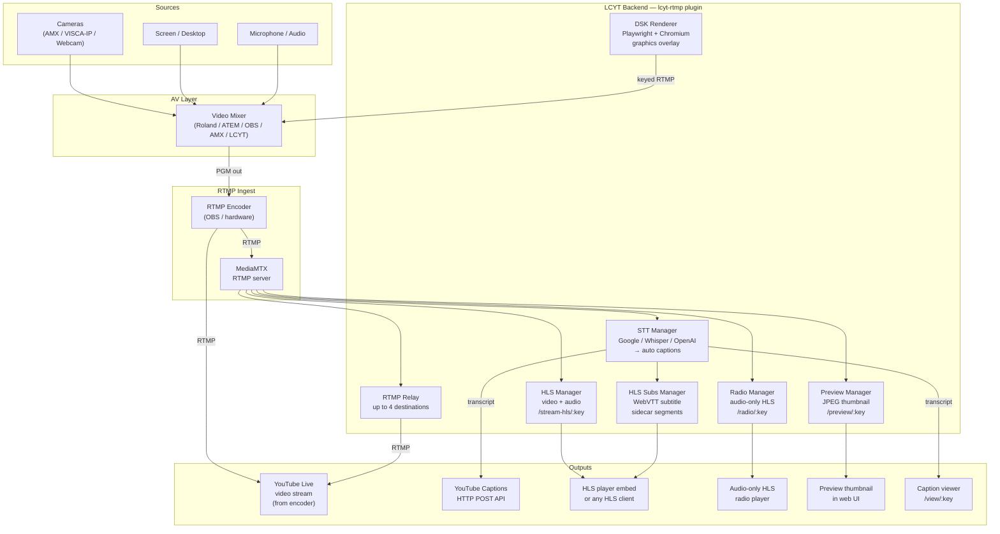
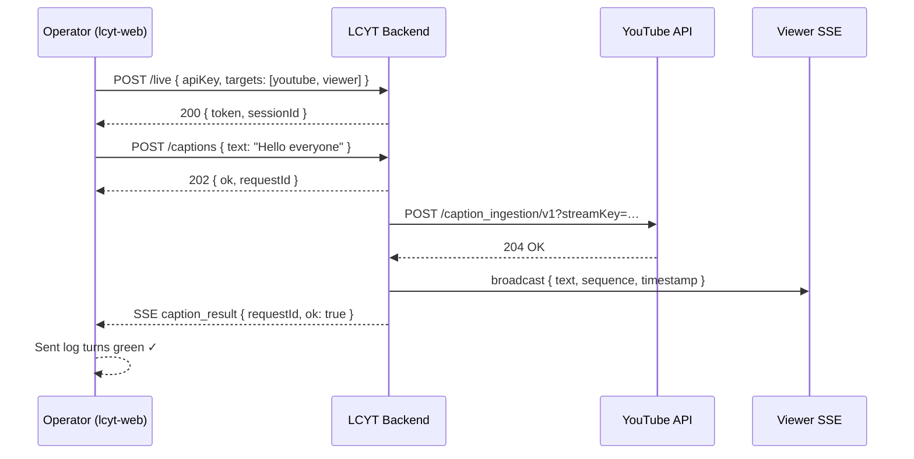
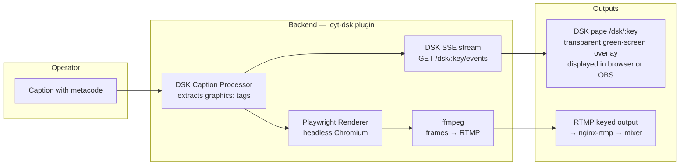

# Application Flow

This page shows how all parts of the LCYT web app work together — from logging in to captions appearing on YouTube.

---

## Full system flow

---

## Caption target types

---

## RTMP & streaming flow

---

## Multi-target session example

A typical broadcast session with captions on YouTube, a public viewer page, and an embedded HLS stream:

---

## DSK graphics flow

